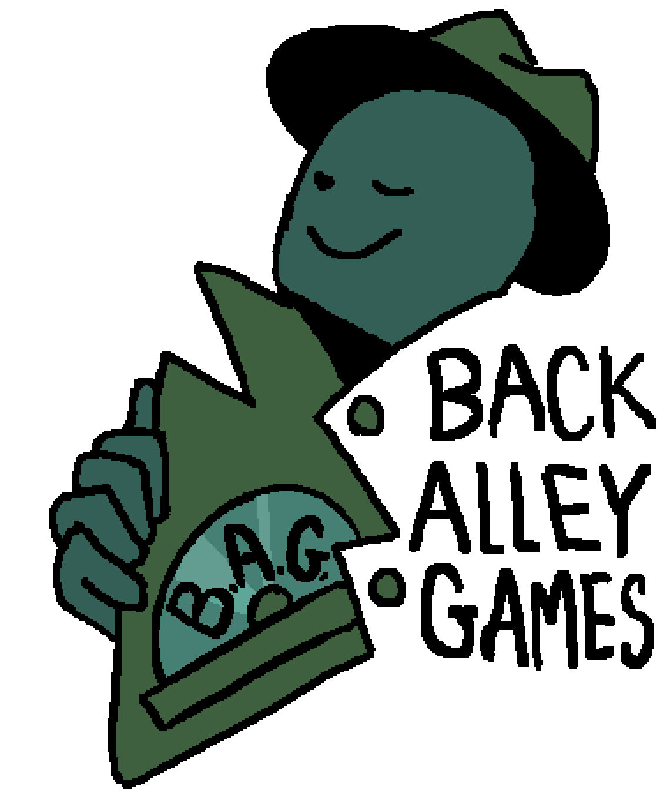

<h1 style="text-align:center">Gold Release</h1>

  <a href="/Gold Release/Siblings' Story - Gold Release/web/index.html">Web Deploy</a>
   

   

  
<h2 style="text-align:center">Beta Release</h2>

  <a href="/Beta Release/Siblings' Story - Beta Release/index.html">Web Deploy</a>
   

  <b>Gameplay Instructions</b> 
  Use the <i>arrow keys</i> (↑, ↓, →, ←) to move around the map. 
  Use the <i>spacebar</i> to interact with the environment. 
  Use the <i>shift key</i> to dash. 
  Use the <i>i key</i> to open the inventory. 
  Use the <i>escape key</i> to view the game menu.  
  <b>If You’ve Played Siblings’ Story Before:</b> 
  Please ensure that you’ve deleted your save game before starting, otherwise you may be unable to save the game. You can delete your saved game by doing the following: 
  Press the <i>shift + ctrl + i keys</i> are the same time.  
  On the menu that just opened up, select “Application” from the menu at the top. If you don’t see Application, press the double arrows >> near the top of the screen and select Application from the list. 
  Click the triangle next to “Local Storage” to expand the list.  
  Select https://dkrammer.github.io/ 
  If you see any files that say “RPG File #”, where # is replaced with a number, right click it and select “Delete”. 

 

<h2 style="text-align: center; float:left; width:50%; display:inline">Vertical Slice</h2>
<h2 style="text-align: center; float:right; width:50%; display:inline">Tech Demo</h2>

<a href="/VS/Siblings' Story - VS/index.html" style="text-align: center; float:left; width:50%; display:inline">Web Deploy</a>
<a href="/Tech Demo/Siblings' Story - Tech Demo/index.html" style="text-align: center; float:right; width:50%; display:inline">Web Deploy</a>

<a href="/VS/Siblings' Story - VS.zip" style="text-align: center; float:left; width:50%; display:inline">Download</a>
<a href="/Tech Demo/Siblings' Story - Tech Demo.zip" style="text-align: center; float:right; width:50%; display:inline">Download</a>

<h5>&nbsp;</h5>
<h5>&nbsp;</h5>

<h3 style="text-align:center">Back Alley Games</h3>

Shashank Bhat

Writer/Lead Designer

Beth Ding

Programmer

Evan Higgs

Audio Designer

Natalie Iwaniuk

Programmer

Duncan Krammer

Programmer/Producer

Zoe Snyder

Artist

Aaron Tripodi

Executive Producer

